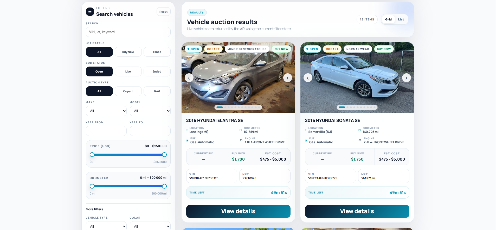
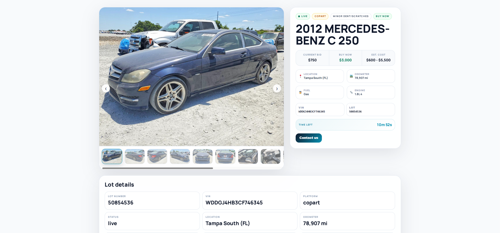
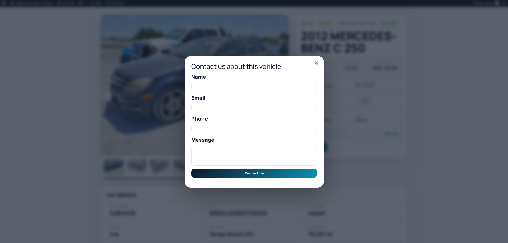
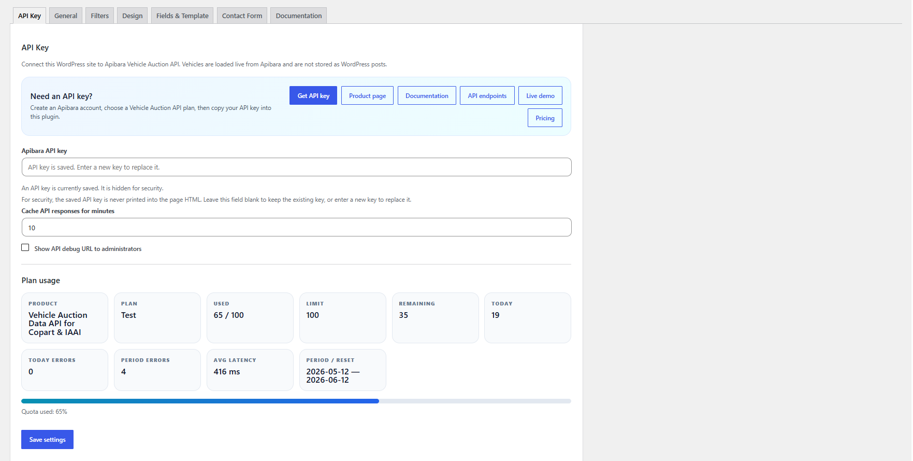
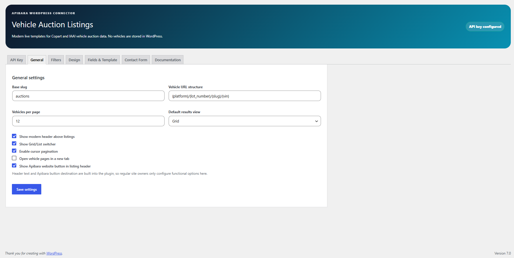
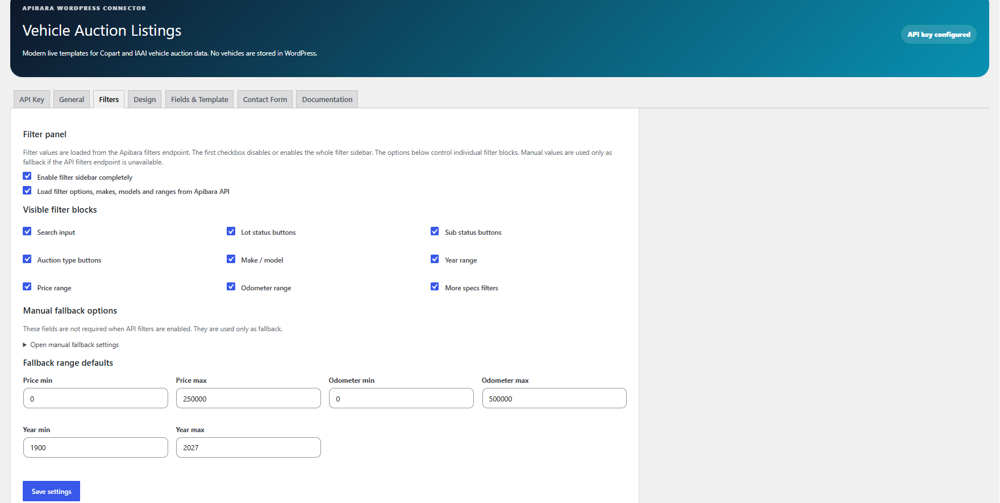
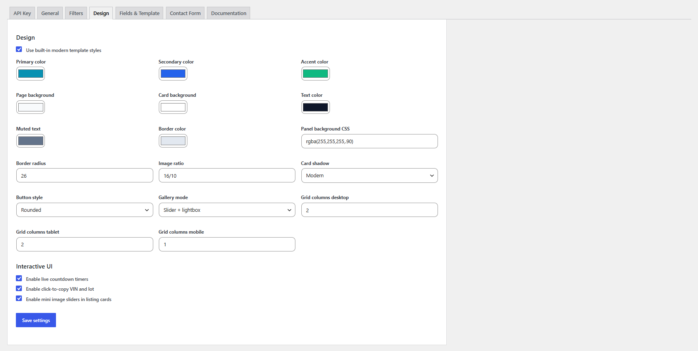
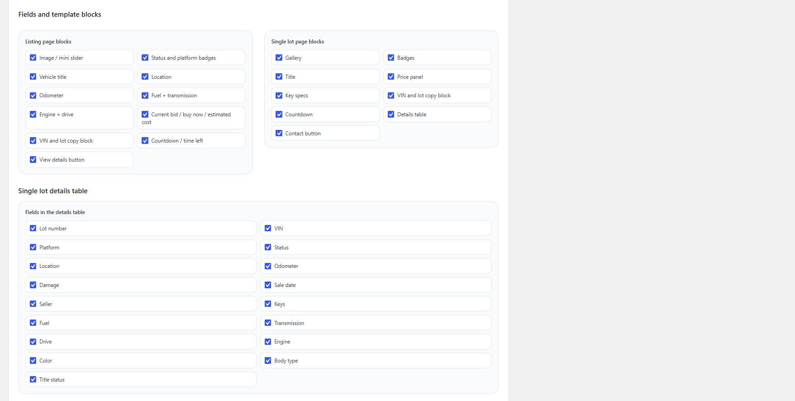
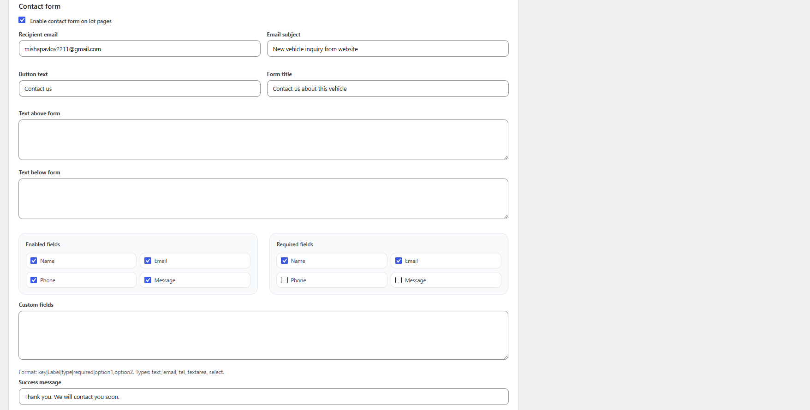
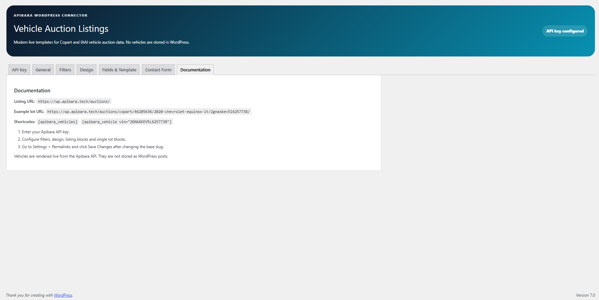

# Apibara Vehicle Auction WordPress Plugin

Official GitHub repository for **Apibara Vehicle Auction Listings**, a WordPress plugin for displaying live Copart and IAAI vehicle auction listings using the Apibara Vehicle Auction Data API.

The plugin is designed for automotive websites, car dealers, auto importers, brokers, marketplaces, and WordPress developers who need to display vehicle auction inventory without importing thousands of vehicles into WordPress.

## WordPress.org Plugin

The plugin is available on WordPress.org:

https://wordpress.org/plugins/apibara-vehicle-auction-listings/

## Overview

Apibara Vehicle Auction Listings connects a WordPress website to the Apibara Vehicle Auction Data API and displays live vehicle auction data through shortcodes.

Instead of storing every vehicle as a WordPress post, the plugin fetches structured auction data from the API and renders vehicle listings, filters, single vehicle pages, photos, prices, VIN/lot information, auction status, and contact forms directly on the website.

This approach is useful for websites where vehicle data changes often and importing a large vehicle inventory into WordPress would make the database heavy or difficult to maintain.

## Features

* Display live Copart and IAAI vehicle auction listings
* Vehicle listing shortcode
* Single vehicle detail shortcode
* VIN and lot number display
* Vehicle photos and gallery
* Auction status
* Prices and Buy Now data when available
* Make, model, year and vehicle specifications
* Search and filter options
* Contact form on vehicle detail pages
* Admin settings for API key and display options
* API usage information
* Designed for automotive, auction, dealer, broker and auto import websites

## Use Cases

This plugin can be useful for:

* Car auction websites
* Auto import websites
* Vehicle marketplaces
* Car dealer websites
* Broker websites
* Automotive lead generation websites
* WordPress developers building automotive projects

## Why Live API Data?

Many automotive websites need a large amount of vehicle auction data.

Importing thousands of vehicles into WordPress as posts can make the database heavy, especially when prices, photos, auction status, sale dates and availability change frequently.

This plugin uses live API-based rendering, so WordPress can display fresh auction data without becoming a large vehicle inventory database.

## Requirements

* WordPress
* PHP compatible with your WordPress installation
* Active Apibara API key
* Access to the Apibara Vehicle Auction Data API

## Installation

### From WordPress.org

1. Go to **WordPress Admin → Plugins → Add New**.
2. Search for **Apibara Vehicle Auction Listings**.
3. Install and activate the plugin.
4. Open the plugin settings page.
5. Add your Apibara API key.
6. Add the shortcode to a page.

WordPress.org plugin page:

https://wordpress.org/plugins/apibara-vehicle-auction-listings/

### Manual Installation

1. Download the plugin ZIP file.
2. Go to **WordPress Admin → Plugins → Add New → Upload Plugin**.
3. Upload the ZIP file.
4. Activate the plugin.
5. Configure your Apibara API key in the plugin settings.

## Shortcodes

### Vehicle Listings

```text
[apibara_vehicles]
```

Use this shortcode to display a vehicle auction listing page.

### Single Vehicle Page

```text
[apibara_vehicle]
```

Use this shortcode to display a single vehicle detail page.

## API Authentication

The plugin uses the `X-API-Key` header to authenticate requests to the Apibara Vehicle Auction Data API.

You can get your API key from your Apibara account.

## API Links

Vehicle Auction Data API:

https://apibara.tech/en/products/vehicle-auction-data-api

API Documentation:

https://apibara.tech/en/products/vehicle-auction-data-api/docs

API Endpoints:

https://apibara.tech/en/products/vehicle-auction-data-api/endpoints

API Demo:

https://apibara.tech/en/products/vehicle-auction-data-api/demo

WordPress Plugin Page:

https://apibara.tech/en/products/vehicle-auction-data-api/plugins/vehicle-auction-wordpress-plugin

## Screenshots

Add screenshots to the `screenshots` directory.

Recommended screenshots:

1. Vehicle listing page
2. Single vehicle detail page
3. Vehicle filters
4. Photo gallery
5. Admin API key settings
6. Admin display/settings page

Example:

```markdown










```

## Roadmap

Possible future improvements:

* Gutenberg blocks
* More design presets
* More filter layout options
* Improved gallery settings
* Elementor widget support
* Better caching controls
* Saved/favorite vehicles
* More contact form integrations
* Additional documentation and examples

## Feedback and Support

Feedback is welcome.

Useful feedback areas:

* Shortcode structure
* Gutenberg block support
* Filter UX
* Vehicle gallery UX
* Single vehicle page layout
* Contact form behavior
* Performance and caching
* Automotive website use cases
* Admin settings UX

Please open an issue if you have suggestions, bug reports, or feature requests.

For support, you can also use the WordPress.org support forum:

https://wordpress.org/support/plugin/apibara-vehicle-auction-listings/

## Links

Website:

https://apibara.tech

WordPress.org Plugin:

https://wordpress.org/plugins/apibara-vehicle-auction-listings/

Vehicle Auction Data API:

https://apibara.tech/en/products/vehicle-auction-data-api

Documentation:

https://apibara.tech/en/products/vehicle-auction-data-api/docs

Demo:

https://apibara.tech/en/products/vehicle-auction-data-api/demo

## License

GPL-2.0-or-later
